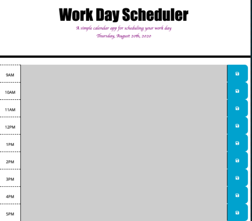

# Day Planner

## Description:

> Created a 9AM-5PM work day scheduler, that allows user to input their plans for the day by the hour. The user is able to input their plans and have it save to local storage. 

> The planner is color coded; 
   - grey = past
   - red = present
   - green = future

> This planner was made to help user keep up with their tasks for the day. jQuery and bootstrap were used to help create this project.

[Deployed Link](https://kmarzi.github.io/day-planner/.)